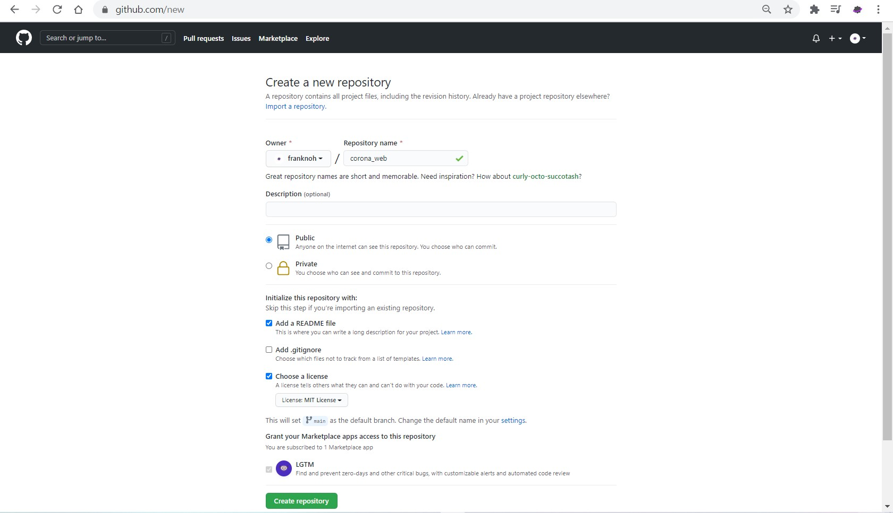
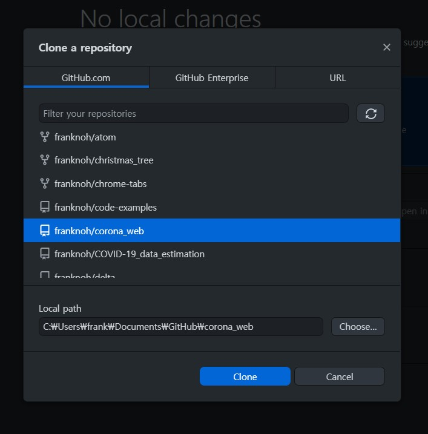
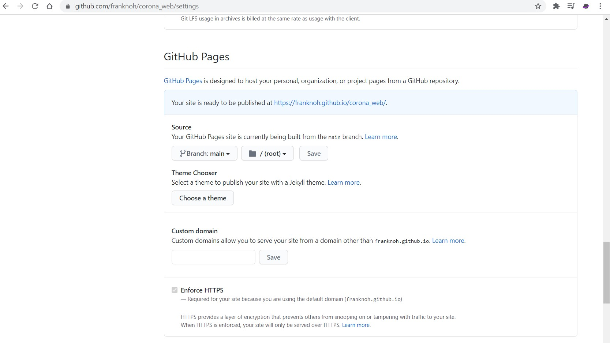
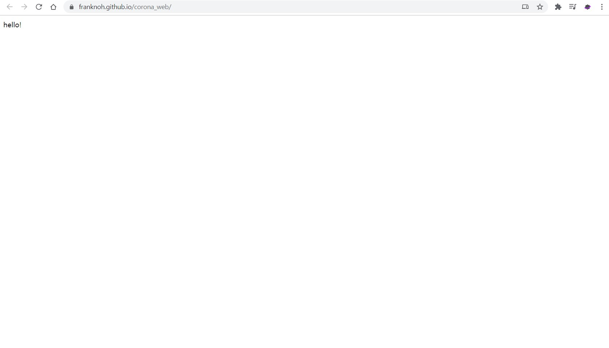
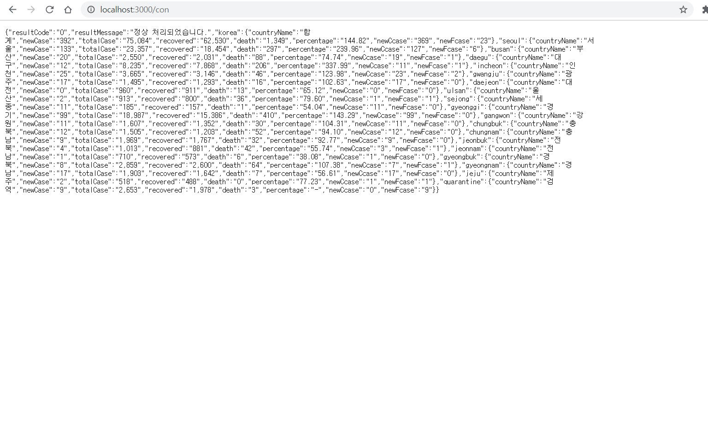
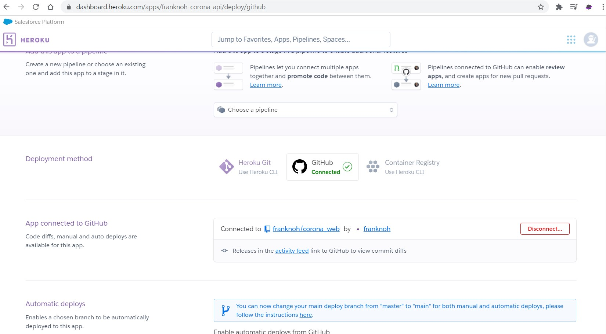
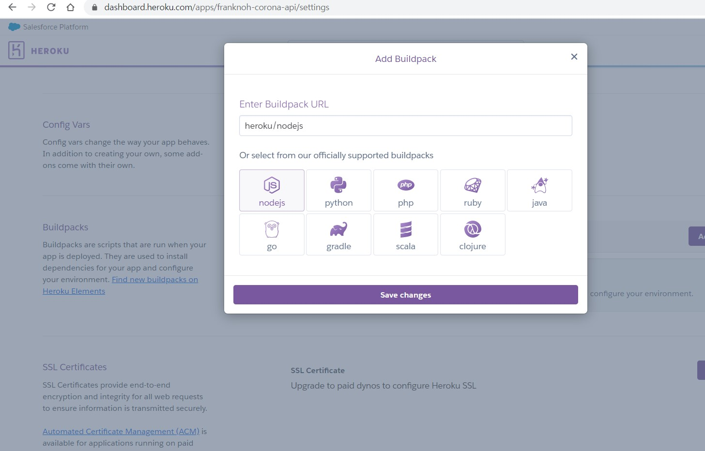
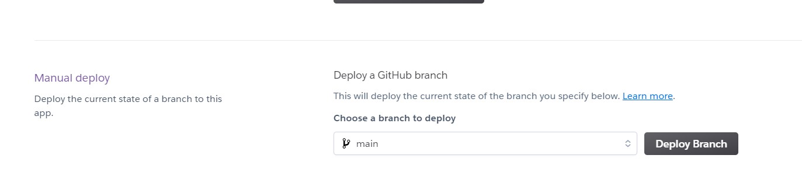

# How To

간단한 코로나 web앱 만들기

준비물

1. github 계정
2. google 계정
3. github desktop
4. vscode

## 1. 기헙 repo 생성


기헙 repo 를 만듭니다.

## 2. api 사용신청

[신청링크](https://api.corona-19.kr/)
api 신청하면 메일이 옵니다.

## 3. firebase 프로젝트 생성


firebase 프로젝트를 만듭니다.
[firebase console 링크](https://console.firebase.google.com/u/0/)

## 4. 깃헙 repo clone합니다

(깃헙 데스크탑 사용)


## 5. vscode에서 열어요

열어요.

## 6. index.html만듭니다

[링크](../index.html)

```html
<!DOCTYPE html>
<html lang="ko">

<head>
    <meta charset="utf-8" />
    <title>franknoh</title>
    <link rel="shortcut icon" type="image/x-icon" href="img/icon.ico" />
    <meta name="viewport" content="width=device-width, initial-scale=1, shrink-to-fit=no" />
    <meta property="og:type" content="website" />
    <meta property="og:title" content="코로나" />
    <meta property="og:description" content="코로나 정보" />
    <meta name="description" content="corona" />
    <meta name="keywords" content="코로나" />
    <link rel="stylesheet" href="style/main.css" />
    <script src="js/jquery.js"></script>
    <script src="js/main.js"></script>
    <script src="js/firebase.js"></script>
</head>

<body>
    hello!
</body>

</html>
```

이런식으로 대충하고 gh-pages나 합시다
일단 커밋하고 push

## 7. gh-pages설정


설정 들어가서
`main`, `/(root)` 선택

잘 되네요

## 8. firebase 완성

콘솔 들어가서 `web`앱 만듭니다
firebase호스팅 안할거고,
```javascript
$(function () {
    var ver = '8.2.1';
    $.getScript('https://www.gstatic.com/firebasejs/' + ver + '/firebase-app.js', function () {
        $.getScript('https://www.gstatic.com/firebasejs/' + ver + '/firebase-analytics.js', function () {
            var firebaseConfig = {
                //your firebase config 여기다가 복붙
            };
            // Initialize Firebase
            firebase.initializeApp(firebaseConfig);
            firebase.analytics();
        });
    });
});
```
`js/firebase.js`만듭니다
그리고
`js/jquery.js`도 만들고
`js/main.js`도 만들어둡니다.

## 9. api 준비

자신의 api키가 노출될수 있으니
rest api를 사용합니다.
express를 사용합니다.
```powershell
npm init -y
npm install express
npm install cors
npm install request
```
그리고 `package.json`도 수정합니다.
```json
  "scripts": {
    "start": "node node/index.js",
  }
```
`node/index.js`도 만듭니다.
```js
var express = require("express");
var request = require("request")
var app = express();
var port = process.env.PORT || 3000;
const bp = require('body-parser')
const cors = require('cors')
const corsOptionsDelegate = (req, callback) => {
    corsOptions = { origin: true }
    callback(null, corsOptions)
}


app.use(cors(corsOptionsDelegate));
app.use(bp.json())
app.use(bp.urlencoded({ extended: true }))
// firebase

app.listen(port, () => {
    console.log("Server running on port 3000");
});

app.get("/all", async (req, res) => {
    request({
        // url에 url입력!
        url: 'https://api.corona-19.kr/korea/?serviceKey=cec0cc672e38cd7b84ba1d2b04de9af04',
        json: true
    }, function (error, response, body) {

        if (!error && response.statusCode === 200) {
            return res.status(200).send(body);
        }
    })
});

app.get("/con", async (req, res) => {
    request({
        // url에 url입력!
        url: 'https://api.corona-19.kr/korea/country/new/?serviceKey=cec0cc672e38cd7b84ba1d2b04de9af04',
        json: true
    }, function (error, response, body) {

        if (!error && response.statusCode === 200) {
            return res.status(200).send(body);
        }
    })
});
```

다음
```powershell
npm start
```

잘 되네요

## 10. node.js 배포

이제 더이상 node.js는 수정할 필요가 없으니 배포합시다.
[heroku](https://dashboard.heroku.com/) 사용

먼저 새 app만들고

github 연결

build pack 변경

그다음 Deploy Branch
